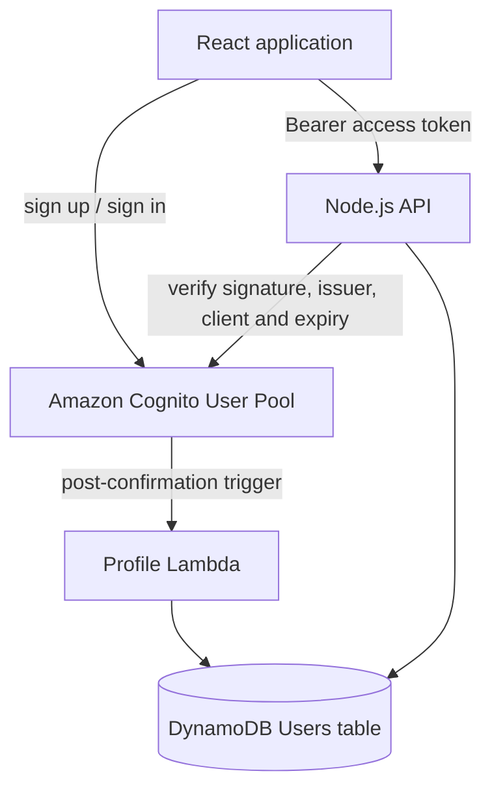

# Authentication and user database

This module gives CtrlAltWin an AWS-native authentication boundary without
coupling it to a specific React framework or Node.js web framework.



## Packages

- `@ctrlaltwin/auth-client`: React-compatible sign-up, confirmation, sign-in,
  password-reset, session and sign-out functions based on Amplify v6.
- `@ctrlaltwin/auth-server`: framework-neutral access-token verification and
  Cognito-group authorization for Node.js backends.
- `@ctrlaltwin/data-access`: DynamoDB user-profile repository.
- `infra`: AWS CDK stack for Cognito, the user table and profile-creation
  trigger.

## Security decisions

- The browser app client has no client secret. A secret cannot be protected in
  browser code.
- The backend verifies Cognito access tokens cryptographically; it never trusts
  a user ID or role supplied by the browser.
- Authorization uses the `cognito:groups` claim. `user` and `admin` groups are
  created by the stack.
- Cognito stores passwords. Passwords are never stored in DynamoDB.
- DynamoDB stores only application profile data and uses encryption at rest,
  on-demand capacity, point-in-time recovery and a retained deletion policy.
- AWS access keys, refresh tokens and JWTs must never be committed to Git.

## Local integration

Install workspace dependencies from the repository root:

```bash
npm install
npm run typecheck
npm test
```

Configure the React application once near its entry point:

```ts
import { configureAuth } from "@ctrlaltwin/auth-client";

configureAuth({
  region: import.meta.env.VITE_AWS_REGION,
  userPoolId: import.meta.env.VITE_COGNITO_USER_POOL_ID,
  userPoolClientId: import.meta.env.VITE_COGNITO_USER_POOL_CLIENT_ID,
});
```

Use `signUpWithEmail`, `confirmEmail`, `signInWithEmail`,
`beginPasswordReset`, `finishPasswordReset`, `getSignedInUser` and
`signOutUser` from the same package. Amplify returns a `nextStep` for flows
that need email confirmation or an MFA challenge; the UI should render the
corresponding form instead of assuming sign-in is complete.

On the Node.js backend:

```ts
import { createAccessTokenAuthorizer } from "@ctrlaltwin/auth-server";

const authorize = createAccessTokenAuthorizer({
  userPoolId: process.env.COGNITO_USER_POOL_ID!,
  userPoolClientId: process.env.COGNITO_USER_POOL_CLIENT_ID!,
});

const claims = await authorize(request.headers.authorization);
const adminClaims = await authorize(request.headers.authorization, ["admin"]);
```

## AWS deployment

Deployment is intentionally separate from source creation so reviewing code
does not create billable resources.

1. Sign in with an IAM identity that can deploy CloudFormation/CDK stacks.
2. Choose the hackathon AWS region (default: `ap-south-1`). Keep Cognito and
   DynamoDB in the same region.
3. Run:

```bash
npm install
npm --workspace @ctrlaltwin/infra run build
npx cdk bootstrap --app "node infra/dist/bin/app.js"
npm --workspace @ctrlaltwin/infra run deploy
```

4. Copy the four CloudFormation outputs into local environment variables using
   `.env.example` as the template. Cognito pool and client IDs are identifiers,
   not secrets.
5. Never place an AWS access-key ID or secret access key in a `VITE_` variable.

## Database ownership

The first table deliberately contains only user profiles. Presentation jobs,
slides, render state and output-video metadata should be modeled from their
access patterns before adding tables. Large presentations, audio and videos
belong in Amazon S3; DynamoDB should store their keys and status, not the binary
files themselves.
